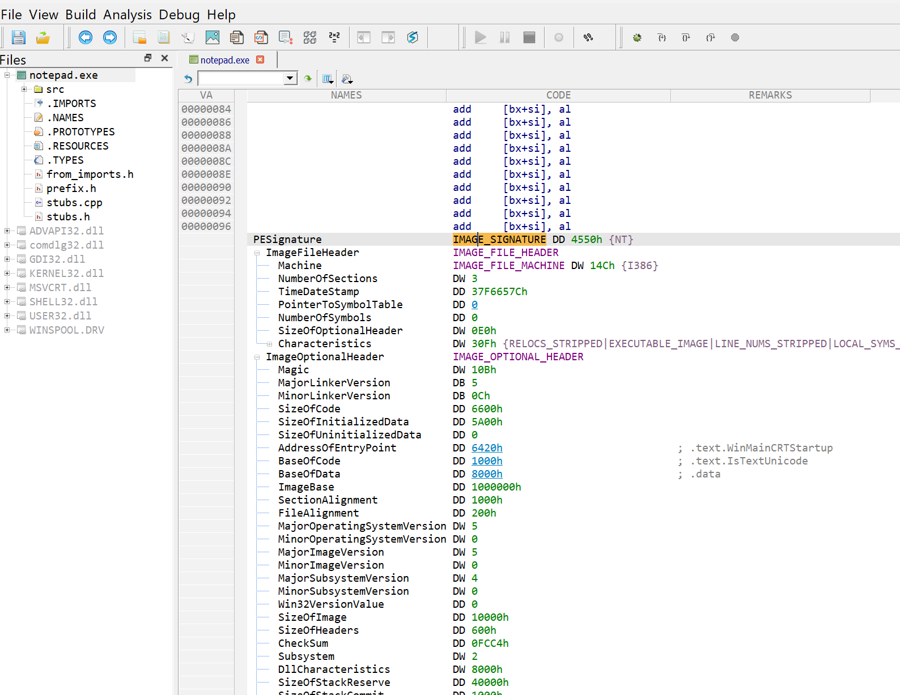

# ADC C/C++ Decompiler v2.0

This is an interactive C/C++ disassembler/de-compiler for Intel 64 and IA-32 (x86) architectures.
The whole idea was to attempt to learn from a binary code by making it more or less human-readable, 
transforming parts of interest to a pseudo-C code with some basic elements of C++ (code/data 
encapsulation, v-tables, possibly, exceptions recovery).

As a disassembler, it is capable of dealing with a bunch of other kinds of processors, including 
ARM/ARM64/MIPS/PPC/Sparc... 

As a side effect, it can serve also as a scriptable binary format viewer. Currently, it supports a few decoders
for some popular binary files formats, like PE/ELF/DWARF/PDB... You open a binary file and navigate it in a 
browser-like manner, following hyperlinks.

